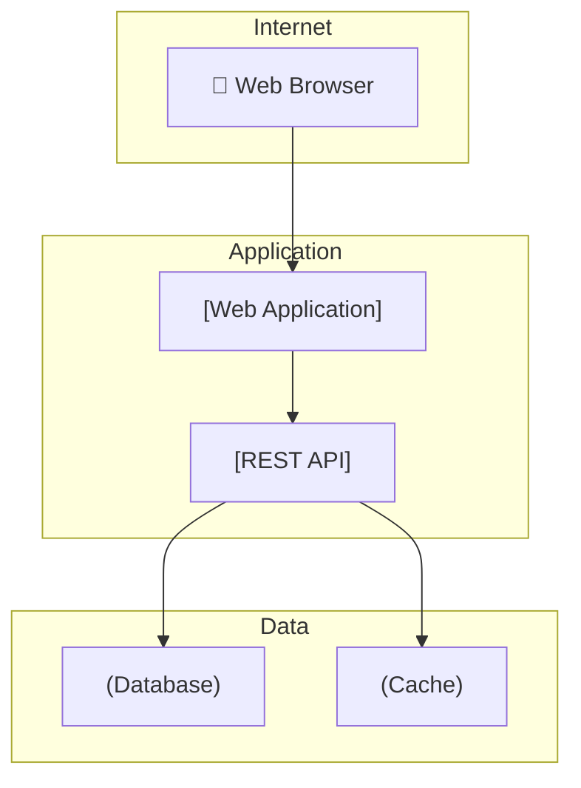
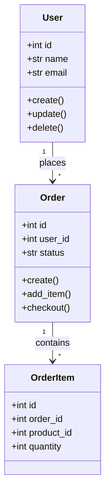

# ArchDrawer

<p align="center">
  
  
  
  
</p>

> 🏗️ **Architecture Diagram Generator** — Generate C4, UML, and ER diagrams from code analysis or simple DSL. Reverse engineer legacy systems and document architectures visually.

## About

**ArchDrawer** creates professional architecture diagrams from code analysis or a simple text-based DSL. It supports C4 model (Context, Container, Component, Code), UML class and sequence diagrams, and ER diagrams. Perfect for documenting systems, reverse engineering legacy code, and creating architecture decision records.

### Who It's For

- **Software Architects** — Document system designs quickly
- **Development Teams** — Visualize code architecture
- **Technical Writers** — Create architecture diagrams for docs
- **Engineers** — Reverse engineer legacy systems

## ✨ Features

### 📊 Diagram Types

| Type | Description | Status |
|------|-------------|--------|
| **C4 Context** | Top-level system overview | ✅ Full |
| **C4 Container** | Applications and data stores | ✅ Full |
| **C4 Component** | Components within a container | ✅ Full |
| **C4 Code** | Code-level class diagrams | 🔜 Future |
| **UML Class** | Class relationships | ✅ Full |
| **UML Sequence** | API call flows | ✅ Full |
| **UML Activity** | Business workflows | 🔜 Future |
| **ER Diagrams** | Database schemas | ✅ Full |

### 🔍 Analysis Features

- **Code Parsing** — AST-based analysis
- **Dependency Graph** — Import/export relationships
- **Database Schema** — PostgreSQL, MySQL, SQLite extraction
- **API Endpoints** — Route mapping
- **Event Detection** — Event/logging patterns

### 📤 Output Formats

| Format | Use Case |
|--------|----------|
| **Mermaid** | Markdown, GitHub, GitLab |
| **SVG** | Web, documentation |
| **PNG** | Presentations, reports |
| **PDF** | Print, formal docs |
| **PlantUML** | Enterprise tooling |
| **draw.io XML** | diagrams.net editor |

### 🖌️ Styling

- **Dark Mode** — Optional dark theme
- **Custom Colors** — Brand colors and themes
- **Custom Fonts** — Font family and size
- **Auto Layout** — Automatic node positioning

## 📐 Architecture

```
┌─────────────────────────────────────────────────────────────────────┐
│                          ArchDrawer                                  │
├─────────────────────────────────────────────────────────────────────┤
│                                                                      │
│  ┌──────────────────────────────────────────────────────────────┐   │
│  │                         CLI Layer                             │   │
│  │  ┌──────────┐  ┌──────────┐  ┌──────────┐  ┌─────────────┐  │   │
│  │  │   draw   │  │ analyze  │  │generate  │  │  examples  │  │   │
│  │  └──────────┘  └──────────┘  └──────────┘  └─────────────┘  │   │
│  └──────────────────────────────────────────────────────────────┘   │
│                              │                                       │
│                              ▼                                       │
│  ┌──────────────────────────────────────────────────────────────┐   │
│  │                    Parser Layer                               │   │
│  │  ┌────────────┐  ┌────────────┐  ┌────────────┐             │   │
│  │  │   DSL      │  │   AST      │  │  Database  │             │   │
│  │  │  Parser    │  │  Parser    │  │  Parser    │             │   │
│  │  └────────────┘  └────────────┘  └────────────┘             │   │
│  └──────────────────────────────────────────────────────────────┘   │
│                              │                                       │
│                              ▼                                       │
│  ┌──────────────────────────────────────────────────────────────┐   │
│  │                   Diagram Engine                               │   │
│  │  ┌────────────┐  ┌────────────┐  ┌────────────┐               │   │
│  │  │    C4      │  │    UML     │  │     ER     │               │   │
│  │  │  Builder   │  │  Builder   │  │  Builder   │               │   │
│  │  └────────────┘  └────────────┘  └────────────┘               │   │
│  └──────────────────────────────────────────────────────────────┘   │
│                              │                                       │
│                              ▼                                       │
│  ┌──────────────────────────────────────────────────────────────┐   │
│  │                   Renderer Layer                              │   │
│  │  ┌──────────┐  ┌──────────┐  ┌──────────┐  ┌─────────────┐   │   │
│  │  │ Mermaid  │  │   SVG    │  │   PNG    │  │  PlantUML   │   │   │
│  │  └──────────┘  └──────────┘  └──────────┘  └─────────────┘   │   │
│  └──────────────────────────────────────────────────────────────┘   │
└─────────────────────────────────────────────────────────────────────┘
```

## 🛠️ Installation

### Prerequisites

- Python 3.11+
- pip

### Standard Installation

```bash
# Clone the repository
git clone https://github.com/moggan1337/ArchDrawer.git
cd ArchDrawer

# Create virtual environment
python -m venv venv
source venv/bin/activate  # Linux/macOS
# or: venv\Scripts\activate  # Windows

# Install dependencies
pip install -r requirements.txt

# Verify installation
python -m src.cli --version
```

### Using pip

```bash
pip install archdrawer
```

## 🚀 Quick Start

### 1. Draw C4 Context Diagram

```bash
echo '
System: WebApp, "Web Application", "Allows users to manage tasks"
System: Database, "Database", "Stores user and task data"
System: Email, "Email Service", "Sends email notifications"

Rel: WebApp -> Database, "Reads/Writes"
Rel: WebApp -> Email, "Sends notifications"
Rel: Email -> Database, "Looks up user emails"
' | python -m src.cli draw -f c4 -o webapp.png
```

### 2. Generate UML Class Diagram

```bash
python -m src.cli draw -f uml-class -o classes.png --content '
class User {
    +id: int
    +name: str
    +email: str
    +created_at: datetime
    +create()
    +update()
    +delete()
}

class Order {
    +id: int
    +user_id: int
    +status: str
    +total: decimal
    +create()
    +add_item()
    +checkout()
}

class OrderItem {
    +id: int
    +order_id: int
    +product_id: int
    +quantity: int
    +price: decimal
}

User "1" -- "*" Order: places
Order "1" -- "*" OrderItem: contains
'
```

### 3. Generate Sequence Diagram

```bash
python -m src.cli draw -f sequence -o api_flow.png --content '
Participant: Client
Participant: API
Participant: Auth
Participant: Database

Client -> API: POST /api/orders
API -> Auth: Validate token
Auth -> Database: Check user
Database --> Auth: User valid
Auth --> API: Token valid
API -> Database: Insert order
Database --> API: Order created
API --> Client: 201 Created
'
```

### 4. Analyze Code Architecture

```bash
python -m src.cli analyze ./src --output architecture.mmd
```

## 📚 CLI Reference

```bash
# Draw diagram from DSL
archdrawer draw [options]
  --content, -c          Diagram content (or use stdin)
  --format, -f           Diagram type: c4|c4-container|c4-component|uml-class|uml-sequence|er
  --output, -o           Output file path
  --renderer             Renderer: mermaid|svg|png|pdf (default: mermaid)
  --dark-mode            Use dark theme
  --font-size            Font size (default: 12)

# Analyze codebase
archdrawer analyze <path> [options]
  --output, -o           Output file path
  --type                Analysis type: c4|uml|dependencies
  --recursive            Analyze subdirectories
  --exclude             Patterns to exclude

# Show examples
archdrawer examples [options]
  --format              Filter by format: c4|uml|er
  --list                List available examples

# Interactive mode
archdrawer interactive

# Initialize config
archdrawer init [options]
  --output, -o          Config file path
```

## 📝 DSL Syntax

### C4 Model

```c4
// Systems
System: [id], "[Name]", "[Description]"
SystemExt: [id], "[Name]", "[Description]"

// Containers
Container: [id], "[Name]", "[Technology]", "[Description]"

// Components
Component: [id], "[Name]", "[Technology]", "[Description]"

// Relationships
Rel: [from] -> [to], "[Description]"
RelBack: [from] <- [to], "[Description]"
RelBi: [from] <-> [to], "[Description]"
```

### UML Class

```uml
class [Name] {
    [+|-|#][field]: [type]
    [+|-|#][method]([param]: [type]): [return_type]
}

[Class1] "multiplicity" -- "multiplicity" [Class2]: relationship
```

### UML Sequence

```seq
Participant: [name]
Participant: [name] as [alias]

[alias1] -> [alias2]: [message]
[alias2] --> [alias1]: return value
[alias2] -> [alias2]: self call
```

### ER Diagram

```er
Entity: [name] {
    +id: int [pk]
    field: type [constraints]
    ...
}

[entity1] ||--o{ [entity2]: relationship
```

## 📂 Project Structure

```
ArchDrawer/
├── src/
│   ├── __init__.py
│   ├── cli.py              # Click CLI interface
│   ├── drawer.py           # Core diagram generation
│   ├── parsers/
│   │   ├── dsl.py          # DSL parser
│   │   ├── ast.py          # Python AST analyzer
│   │   └── database.py     # DB schema extractor
│   ├── generators/
│   │   ├── c4.py           # C4 model generator
│   │   ├── uml.py          # UML diagram generator
│   │   └── er.py           # ER diagram generator
│   └── renderers/
│       ├── mermaid.py       # Mermaid output
│       ├── svg.py           # SVG rendering
│       └── dot.py           # Graphviz DOT
├── tests/
│   ├── test_drawer.py
│   ├── test_parsers.py
│   └── test_generators.py
├── examples/
│   ├── c4/
│   ├── uml/
│   └── er/
├── requirements.txt
├── pyproject.toml
└── README.md
```

## ⚙️ Configuration

### `archdrawer.toml`

```toml
[default]
format = "png"
dpi = 150
dark_mode = false
font_family = "sans-serif"
font_size = 12

[theme]
background_color = "#ffffff"
text_color = "#333333"
primary_color = "#0066cc"
secondary_color = "#6c757d"
border_color = "#dee2e6"

[c4]
default_level = "container"
show_technology = true

[uml]
show_attributes = true
show_methods = true
show stereotypes = true

[er]
show_types = true
show_keys = true
```

## 📊 Example Outputs

### C4 Container Diagram



### UML Class Diagram



## 🤝 Contributing

1. **Fork** the repository
2. **Create a feature branch**: `git checkout -b feature/amazing-feature`
3. **Commit changes**: `git commit -m 'Add amazing feature'`
4. **Push to branch**: `git push origin feature/amazing-feature`
5. **Open a Pull Request**

### Development Setup

```bash
git clone https://github.com/moggan1337/ArchDrawer.git
cd ArchDrawer
python -m venv venv
source venv/bin/activate
pip install -e ".[dev]"
pytest tests/ -v
```

## 📄 License

MIT License — see [LICENSE](LICENSE) for details.

---

<p align="center">
  Built with ❤️ for developers who value clear architecture
</p>
